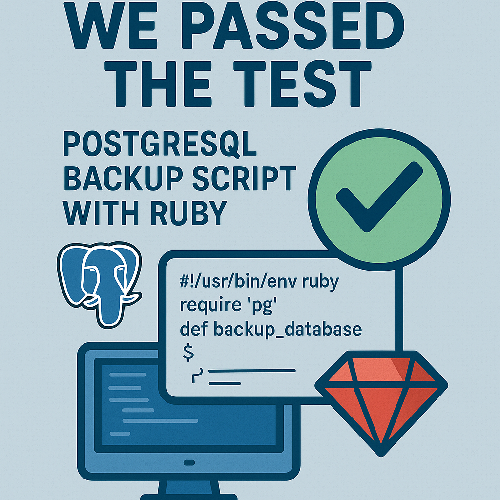

# PostgreSQL 17+ Incremental Backup & Restore Tool

This tool provides an automated, containerized solution for creating and managing full and incremental backups for PostgreSQL 17 and newer, leveraging its native incremental backup capabilities.

It is designed to be run via `podman` and integrated with `systemd` using Quadlets.

## Features

-   **Automated Backup Strategy**: Performs a full backup periodically (e.g., every 14 days) and incremental backups on all other days.
-   **Flexible Time-Based Retention**: Independently configure how long to keep full backups (and their dependent chains) and how long to keep granular incremental backups. This allows for strategies like keeping daily backups for a week and full backups for a month.
-   **Safety-First Pruning**: The currently active backup chain is **never** touched by the pruning process, ensuring you can always restore from the most recent set of backups.
-   **Simple Restore**: Can restore from any backup in a chain (full or incremental) to a target directory using `pg_combinebackup`.
-   **Containerized**: Runs inside a `podman` container, isolating dependencies.
-   **Systemd Integration**: Uses Quadlet files for easy and robust scheduling with `systemd`.
-   **Clear Metadata**: Avoids fragile filesystem parsing by saving its own `metadata.json` inside each backup folder.

## Prerequisites

-   A running PostgreSQL 17+ server.
-   A dedicated PostgreSQL user with the `pg_read_all_data` role (or superuser privileges).
-   `podman` installed on the host machine.
-   A host OS that uses `systemd` (e.g., Fedora, CentOS, Ubuntu 22.04+).
-   Postgres configured with `summarize_wal` enabled and `wal_summary_keep_time` greater than the interval between your incremental backups (the default of `10d` is usually sufficient for daily backups).

## Slon




## 1. Setup

### Step 1: Build the Container Image

Clone this repository and build the Podman image from the `Dockerfile`.

```bash
podman build -t postgres-backup:latest .
```

### Step 2: Create Directories and Configuration

Create the host directories for backups and the environment file for secrets.

```bash
# Create directories for backups and restores
sudo mkdir -p /var/lib/pgbackups/data /var/lib/pgbackups/restore
sudo chown your_user:your_user /var/lib/pgbackups/data /var/lib/pgbackups/restore

# Create the environment file for secrets
sudo mkdir -p /etc/default
sudo touch /etc/default/postgres-backup
```

Edit the environment file `/etc/default/postgres-backup` with your database connection details and desired retention policy:

```ini
# /etc/default/postgres-backup
PGHOST=your-db-host.or.ip
PGPORT=5432
PGUSER=backup_user
PGPASSWORD=your_super_secret_password
PGDATABASE=postgres

# --- Backup Strategy Configuration ---

# Number of days between full backups.
FULL_BACKUP_INTERVAL_DAYS=14

# Days to keep a full backup and its entire chain.
# After this period, the whole chain is deleted.
KEEP_FULL_DAYS=30

# Days to keep individual incremental backups in older (but retained) chains.
# This allows you to prune daily backups while keeping the full ones for longer.
KEEP_INCREMENTAL_DAYS=7
```

Set secure permissions for this file:

```bash
sudo chmod 600 /etc/default/postgres-backup
```

### Step 3: Install Quadlet Files

Copy the `.container` and `.timer` files to the systemd user or system location. For system-wide services, use `/etc/containers/systemd/`.

First, edit `backup.container` to use the correct host paths:

```ini
# In backup.container, change these lines:
...
Volume=/var/lib/pgbackups/data:/backups:Z
Volume=/var/lib/pgbackups/restore:/restore:Z
...
```

Now, copy the files and reload systemd:

```bash
# As root, or with sudo
cp backup.container /etc/containers/systemd/
cp backup.timer /etc/containers/systemd/

# Reload systemd to recognize the new files
systemctl daemon-reload
```

### Step 4: Enable and Start the Timer

The timer will trigger the backup service at the scheduled time.

```bash
# Enable the timer to start on boot
systemctl enable --now backup.timer

# Check the status of the timer
systemctl list-timers backup.timer
```

Your automated backups are now configured!

## 2. Usage

### Manual Backup

To trigger a backup manually, you can start the service directly:

```bash
systemctl start backup.service
```

Or run it with `podman` for immediate feedback:

```bash
podman run --rm -it \
  --env-file /etc/default/postgres-backup \
  -v /var/lib/pgbackups/data:/backups:Z \
  localhost/postgres-backup:latest backup
```

### Manual Restore

To restore a backup, you must provide the path to the specific backup directory you want to restore *to*. This can be a full or an incremental backup. The script will automatically find all required parent backups in the chain.

The restored, ready-to-use PostgreSQL data directory will be placed in the `/restore` volume mount.

**Example:** Let's say you want to restore the state from an incremental backup located at `/var/lib/pgbackups/data/2025-05-15_02-00-10_incremental`.

```bash
podman run --rm -it \
  --env-file /etc/default/postgres-backup \
  -v /var/lib/pgbackups/data:/backups:Z \
  -v /var/lib/pgbackups/restore:/restore:Z \
  localhost/postgres-backup:latest restore /backups/2025-05-15_02-00-10_incremental
```

After the command completes, the directory `/var/lib/pgbackups/restore` on your host will contain a full, restored PostgreSQL data directory. You can then copy this directory to your new database server, create a `recovery.signal` file, and start PostgreSQL to perform Point-in-Time Recovery using your archived WAL files.

## Configuring Your Backup Strategy

This tool uses a flexible, two-tiered retention policy controlled by environment variables. Understanding how they interact is key to designing a strategy that fits your needs.

-   `KEEP_FULL_DAYS`: Controls the maximum age of a **full backup**. If a full backup is older than this value, it and **all of its associated incremental backups** are deleted together as a complete chain. This is the ultimate lifespan of any backup.

-   `KEEP_INCREMENTAL_DAYS`: Controls the retention of an **entire set of incremental backups** for a given chain. If the **oldest** incremental in a chain is older than this value, then **all incrementals in that chain are deleted together**, leaving only the full backup for long-term retention. This treats the incremental history as a single, atomic unit.

**The Golden Rule:** The most recent backup chain (the one currently being added to) is **always kept fully intact**, regardless of these settings. Pruning only applies to older, completed chains.

### Example Strategies

Here are a few common scenarios to illustrate how you can configure the script.

#### Strategy 1: Standard (Default) - Granular history for a week, long-term fulls for a month.

You want to restore to any specific point within the last week. For anything older, you're happy with just having the full backups available.

*   **Configuration:**
    ```ini
    FULL_BACKUP_INTERVAL_DAYS=14 # (default)
    KEEP_FULL_DAYS=30
    KEEP_INCREMENTAL_DAYS=7
    ```
*   **Outcome:**
    *   You will always have the current, active chain (up to 14 days of granular backups).
    *   For an older chain, the script checks its very *first* incremental backup.
        *   If that first incremental is now **older than 7 days**, all of its following incrementals are deleted at once. This cleanly retires the granular history, leaving only the full backup for long-term storage (which will be kept for up to 30 days).
        *   If that first incremental is **7 days old or newer**, the entire set of incrementals for that chain is kept, preserving your granular restore points.

#### Strategy 2: Long-Term Archival - Keep fulls for a year, incrementals for two weeks.

You have compliance requirements to keep monthly or bi-weekly snapshots for a long time, but you don't need the daily history from months ago.

*   **Configuration:**
    ```ini
    KEEP_FULL_DAYS=365
    KEEP_INCREMENTAL_DAYS=14
    ```
*   **Outcome:**
    *   Your full backups will be preserved for an entire year.
    *   To save significant space, the entire incremental history for a given chain is pruned once its *oldest* incremental passes the 14-day mark. This gives you a two-week window for granular recovery on recent chains, while relying on the less-frequent full backups for long-term archival.

#### Strategy 3: Short-Term Retention - Keep a rolling window, then delete.

You only care about short-term operational recovery and don't need long-term archives.

*   **Configuration:**
    ```ini
    FULL_BACKUP_INTERVAL_DAYS=14 # (default)
    KEEP_FULL_DAYS=14
    KEEP_INCREMENTAL_DAYS=14
    ```
*   **Outcome:**
    *   This configuration ensures that as soon as a new full backup is created (starting a new chain), the previous chain becomes eligible for pruning.
    *   Because the old chain's full backup will be ~14 days old, it will be immediately targeted by the `KEEP_FULL_DAYS=14` rule. The entire old chain (full + all its incrementals) will be deleted on the next run.
    *   This effectively keeps a clean, rolling ~14-28 day window of all backups.