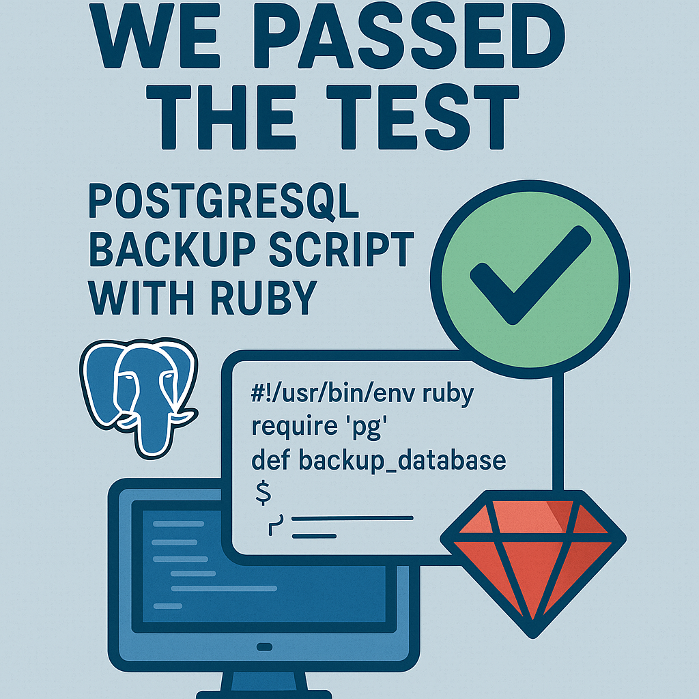

# pgwaiter

Incremental PostgreSQL backup and restore in a container. Uses PostgreSQL 17+'s native incremental backup (`pg_basebackup --incremental`) and `pg_combinebackup` for restore. No WAL archiving, no daemon, no extra moving parts — just run it on a schedule.

<p align="center">

</p>

## How it works

Each run performs a **full** or **incremental** backup depending on how old the last full is, then prunes expired backups. Retention is controlled by two independent timers:

- `KEEP_FULL_DAYS` — maximum age of a full backup and its entire chain (default: 30)
- `KEEP_INCREMENTAL_DAYS` — how long to keep incrementals within a retained chain (default: 7)

The active (most recent) chain is never pruned.

## PostgreSQL requirements

```sql
-- Enable WAL summaries (required for incremental backups)
-- In postgresql.conf:
summarize_wal = on

-- Create a dedicated backup user
CREATE ROLE pgbackup WITH LOGIN REPLICATION PASSWORD 'strongpassword';
GRANT pg_read_all_data TO pgbackup;

-- In pg_hba.conf, allow replication connections:
host  replication  pgbackup  all  scram-sha-256
```

## Environment variables

| Variable | Default | Description |
|---|---|---|
| `PGHOST` | — | PostgreSQL host |
| `PGPORT` | `5432` | PostgreSQL port |
| `PGUSER` | — | Backup user |
| `PGPASSWORD` | — | Password |
| `PGDATABASE` | `postgres` | Database to connect to |
| `FULL_BACKUP_INTERVAL_DAYS` | `14` | Days between full backups |
| `KEEP_FULL_DAYS` | `30` | Days to retain a full backup + its chain |
| `KEEP_INCREMENTAL_DAYS` | `7` | Days to retain incrementals in older chains |
| `BACKUP_DIR` | `/backups` | Backup destination inside the container |
| `RESTORE_DIR` | `/restore` | Restore destination inside the container |
| `PG_BIN_DIR` | `/usr/bin` | Path to `pg_basebackup` / `pg_combinebackup` |

## Usage

### Docker / Podman

```bash
# Backup
docker run --rm \
  -e PGHOST=db.example.com \
  -e PGUSER=pgbackup \
  -e PGPASSWORD=strongpassword \
  -v /var/lib/pgbackups:/backups \
  ghcr.io/your-org/pgwaiter:latest backup

# Restore (chain resolved automatically from target path)
docker run --rm \
  -v /var/lib/pgbackups:/backups \
  -v /var/lib/pgrestore:/restore \
  ghcr.io/your-org/pgwaiter:latest restore /backups/2025-05-15_02-00-10_incremental
```

### systemd (Quadlet)

Copy `contrib/backup.container` and `contrib/backup.timer` to `/etc/containers/systemd/`, edit the volume paths and env vars, then:

```bash
systemctl daemon-reload
systemctl enable --now backup.timer
```

### systemd (plain service, e.g. with incus/lxc)

```ini
# /etc/systemd/system/pgwaiter-backup.service
[Unit]
Description=pgwaiter PostgreSQL backup
After=network-online.target

[Service]
Type=oneshot
ExecStart=/usr/bin/incus start pgwaiter-backup
ExecStart=/usr/bin/incus wait pgwaiter-backup status=stopped
```

```ini
# /etc/systemd/system/pgwaiter-backup.timer
[Timer]
OnCalendar=*-*-* 01:00:00
Persistent=true

[Install]
WantedBy=timers.target
```

### Kubernetes CronJob

```yaml
apiVersion: batch/v1
kind: CronJob
metadata:
  name: pgwaiter-backup
spec:
  schedule: "0 1 * * *"
  jobTemplate:
    spec:
      template:
        spec:
          restartPolicy: OnFailure
          containers:
          - name: pgwaiter
            image: ghcr.io/your-org/pgwaiter:latest
            args: ["backup"]
            env:
            - name: PGHOST
              value: postgres.example.com
            - name: PGUSER
              value: pgbackup
            - name: PGPASSWORD
              valueFrom:
                secretKeyRef:
                  name: pgwaiter-secret
                  key: password
            volumeMounts:
            - name: backups
              mountPath: /backups
          volumes:
          - name: backups
            persistentVolumeClaim:
              claimName: pgwaiter-backups
```

## Retention strategies

| Goal | Config |
|---|---|
| Daily granularity for 1 week, fulls for 1 month (default) | `KEEP_FULL_DAYS=30`, `KEEP_INCREMENTAL_DAYS=7` |
| Fulls for 1 year, incrementals for 2 weeks | `KEEP_FULL_DAYS=365`, `KEEP_INCREMENTAL_DAYS=14` |
| Rolling 2-week window only | `KEEP_FULL_DAYS=14`, `KEEP_INCREMENTAL_DAYS=14` |
